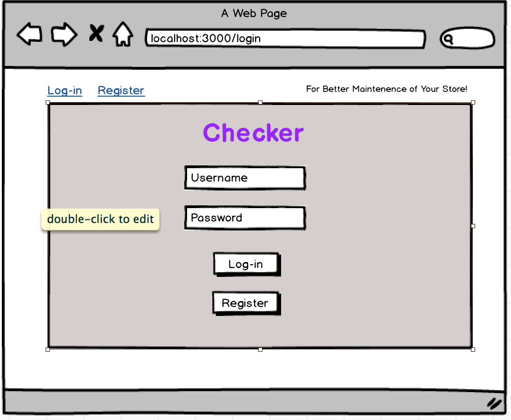
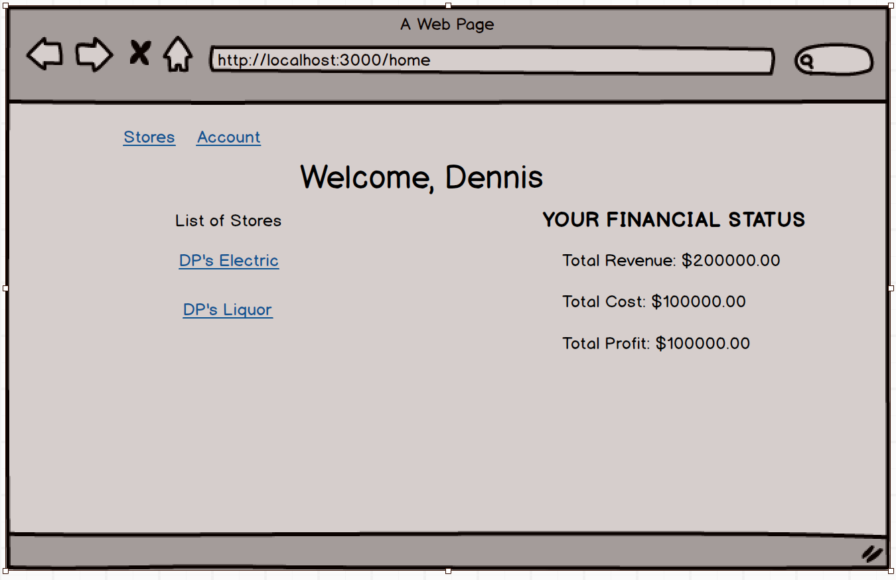
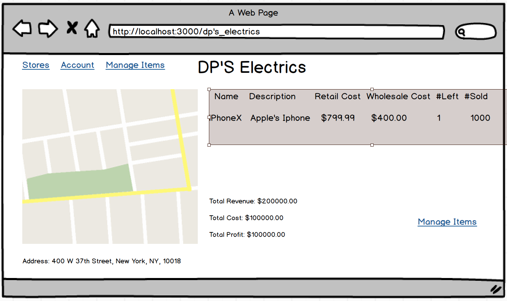
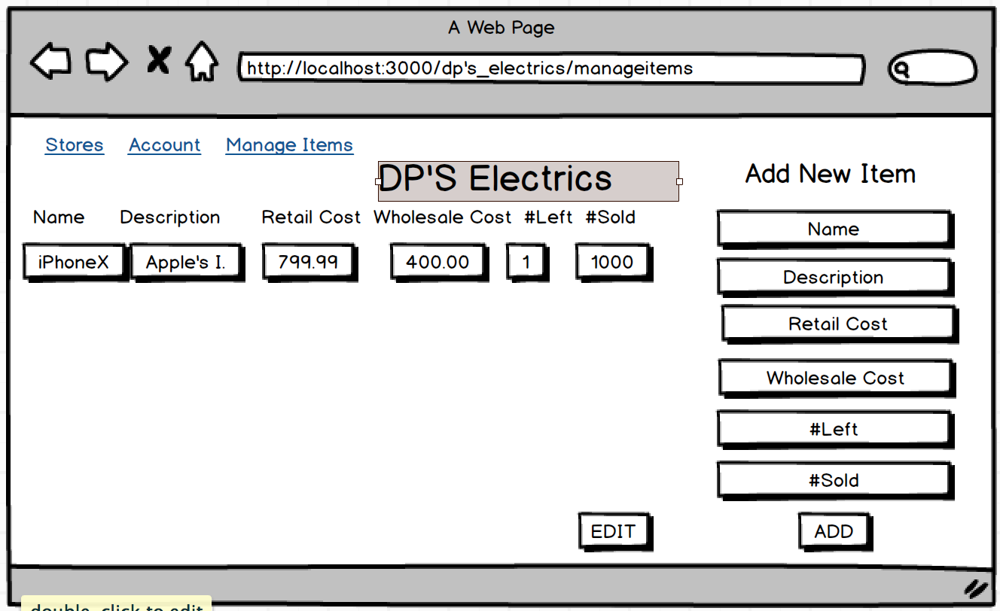
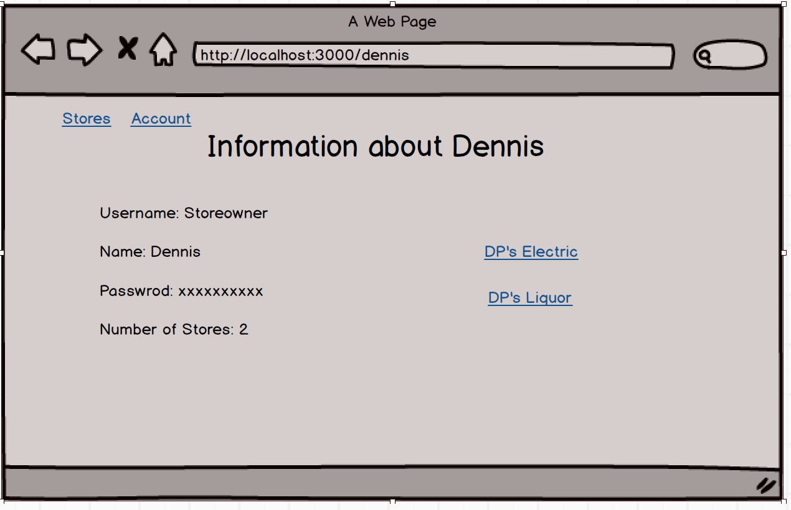
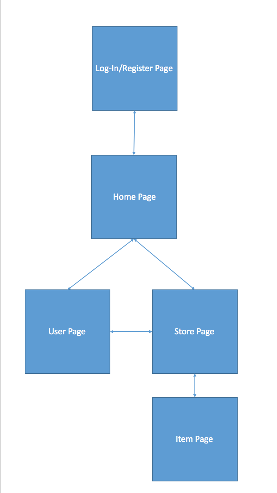

# Checker(Trying to come up with new name)

## Overview


Checker is a web app that will allow store owners to check their inventories in their stores.

Store Owners can check inventory and their revenues, cost, profits by using the app


## Data Model


The application will store Users(Store Owners), Stores, and items


(___TODO__: sample documents_)

An Example User:

```javascript
{
  username: "storeowner",
  password: // a password hash,
}
```

An Example Store:

```javascript
{
  user// a reference to a User object
  storename: "DP's Electrics",
  store address: "400 W 37th Street",
  store state: "NY",
  store zipcode: "10018",
  revenue: "3000000.00",
  cost: "200000.00"
  profit: "100000.00"
}
```
An Example Item

```javascript
{
  store: // a reference to a Store object
  item name: "iPhoneX",
  description: "Apple's iPhone 7",
  retail cost: "799.99",
  wholesale cost: "400.00",
  stock left: "1",
  num sold: "1000"
  updatedAt: // timestamp
}
```


## [Link to Commented First Draft Schema](db.js)


## Wireframes


/login- page to login



/home - a page showing list of stores owner owns and financial information



/:slug - page for Store Details



/:slug/manageitems - page to manage manage items



/user - page to manage user



## Site map



## User Stories or Use Cases

1. as non-registered user, I can register a new account with the site
2. as a user, I can log in to the site
3. as a user, I can create new Store
4. as a user, I can view current status of my Store(including revenue, cost, profit, location on google maps)
5. as a user, I can add items to my Store
6. as a user, I can adjust number of stocks left and number of items sold

## Research Topics


* (5 points) Integrate user authentication
    * I'm going to be using passport for user authentication
    * Can register by filling in the fields (must be unused username)
* (3 points?) Google Maps
    * Use it to Locate User's Store on a Map
    * First time implementing it, but always wanted to since most websites and apps have google maps this days
* (2 points) CSS Framework - Bootstrap
    * It Allows better environment to create and maintain
    * One CSS allows Desktop, Phones, and tablets

10 points total out of 8 required points


## [Link to Initial Main Project File](app.js)


## Annotations / References Used


1. [passport.js authentication docs](http://passportjs.org/docs)
2. [Google Maps Javascript API Tutorial](https://developers.google.com/maps/documentation/javascript/)
3. [tutorial on Bootstrap](https://getbootstrap.com/docs/3.3/css/)
